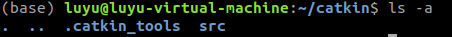
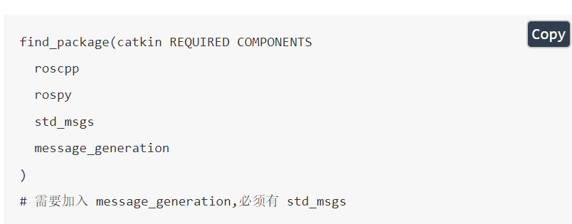
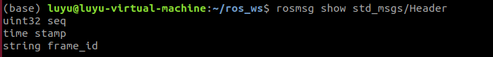
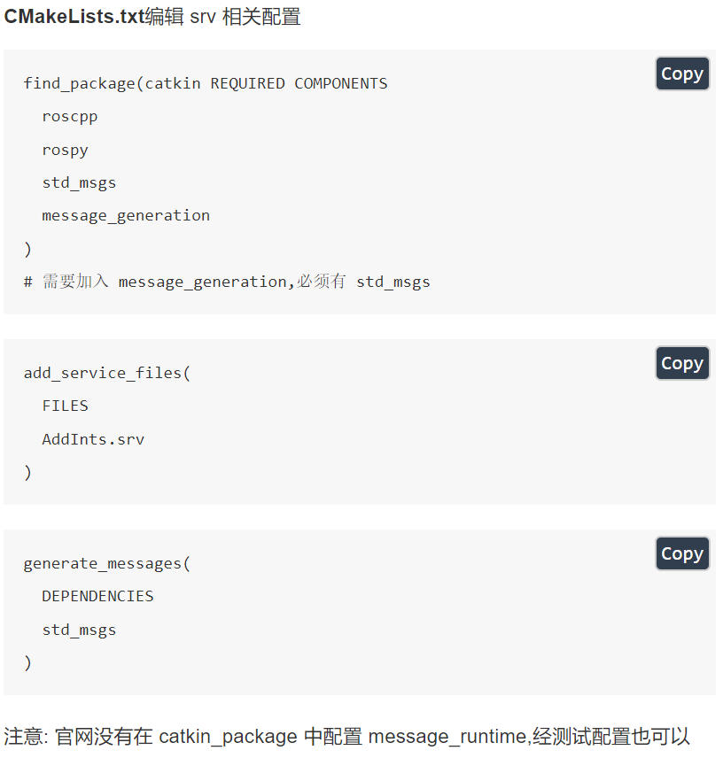
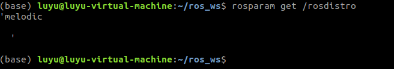

# ROS工具使用详解

## 一. 常规工具

### （1）Catkin 工具

##### 1. 第一套是catkin_make

- 创建和初始化ROS工作空间

  ```shell
  mdkir -p catkin/src
  cd catkin/src
  catkin_init_workspace
  ```

  - catkin_init_workspace就是 建立一个指向ros源文件中toplevel.cmake文件的软链接，
  - 这个文件是一个flag，一个标识，只有一个文件夹里有这个文件，系统才会将其识别为一个ros的工作空间

- 编译工作空间

  ```shell
  cd ..
  catkin_make
  ```

  

  - 首次编译生成build文件夹，devel文件夹
  - build文件夹：为该工作空间的编译空间，在使用cmake和catkin等工具进行编译时存储缓存信息、配置和其他中间文件
  - devel文件夹：这个目录为工作空间用来保存编译完成的功能包的目录

- 单独编译功能包

  ```shell
  catkin_make --pkg 功能包名字
  ```

  

##### 2. 第二套是catkin build

- 创建和初始化工作空间

  ```shell
  mkdir -p catkin/src
  cd catkin
  catkin init
  ```

  



- 构建和编译工作空间

  ```shell
  catkin build
  ```

  

------


### （2）查询现在ROS正在使用的工作空间

- **ROS正在使用的工作空间**：就是当前你需要运行的ROS节点所在功能包他的工作空间，需要将其添加到ROS正在使用中的工作空间环境变量，你执行rosrun或者roslaunch才能找到相应的可执行文件

- **命令**：

  ```shell
  echo $ROS_PACKAGE_PATH
  ```

  

------


### （3）将工作空间加入ROS搜索路径

- **命令**：

  ```shell
  source ~/工作空间目录/devel/setup.bash
  ```

  会将该工作空间的路径添加到ROS的搜索路径中

- 如果闲每次都要source一下很麻烦，可以将其添加到用户shell配置文件.bashrc中

------


### （4）用于ROS环境中导航的命令行工具

- **rospack**：用于对功能包操作，前提是在ros的搜索路径中存在

```shell
rospack find turtlesim	//寻找某个包所在的路径
rospack list	// 列出现在搜索路径中所有的包
rospack depend-on turtlesim // 列出功能包所有依赖项
rospack profile		// 提供新添加到ROS中功能包的信息
```

- **rosstack**：用于对堆栈的操作，即元功能包，元功能包是由一系列功能包组成的并不实际存在的功能包，只是一个将能够完成一个任何所需要的各个功能包组合成一个组，用来完成一个特定的任务。

```shell
rosstack find ros_comm	// 寻找某个元功能包的路径
rosstack list 		// 列出元功能包
```

- **roscd：**用于直接进入某个功能包所在。

```shell
roscd turtlesim
```

- **rosls：**用于列出功能包中所有文件

```shell
rosls turtlesim
```

------


### （5）创建功能包

- **命令：**

```shell
catkin_create_pkg 功能包名	依赖功能包名
```

------


### （6）元功能包

- 元功能包是ROS中一种特殊包，只含一个package.xml。他将一系列的功能包简单的组合成一个逻辑包

- package里面 <export> 标签证明其是一个元功能包

------


## 二. 消息工具

### （1）msg消息构建及类型：

- **在功能包下创建msg文件夹，存放.msg文件，并且编写.msg文件**

- **修改package.xml文件，添加编译依赖与执行依赖**


- 修改CMakeList.txt编辑msg相关的cmake编译的脚本

  - 添加编译时依赖的功能包

  - 添加需要编译的msg文件

  - 添加生成消息的依赖

  - 添加执行的依赖

- **消息的类型：**


### （2）rosmsg工具使用

- **rosmsg show**：显示msg的内容

- **rosmsg info**：跟rosmsg show一样，只不过是其别名
- **rosmsg list**：列出所有的.msg消息文件
- **rosmsg md5[功能包名]** ：显示MD5校验码
- **rosmsg package [功能包名]** ：列出该功能包中所有的.msg消息文件
- **rosmsg packages**：列出所有含有.msg消息文件的功能包


## 三. 节点工具

**节点**：本质上就是一个个使用客户端库执行就算功能的进程

一个节点 可以通过 ros话题、服务、参数服务器和其他节点通信

### （1）rosnode工具使用

- **rosnode info [节点]**：打印有关节点的信息
- **rosnode kill [节点]**：结束正在运行的节点

- **rosnode list**：显示现在正在运行的节点
- **rosnode machine hostname**：列出某个机器上正在运行的节点
- **rosnode ping [node]**：测试节点的连通性
- **rosnode cleanup**：清楚不可达节点的注册信息


## 四. 话题工具

### （1）rostopic工具使用

- **rostopic list**：列出所有活跃的话题

- **rostopic bw  /topic:**	显示话题使用的带宽
- **rostopic echo  /topic:** 将消息打印到屏幕上
- **rostopic find  message_type:** 通过消息类型找到话题
- **rostopic hz /topic:** 显示话题发布的频率
- **rostopic info  /topic:** 显示话题的详细信息

- **rostopic pub /topic type args:** 向一个话题发布指定类型的消息

- **rostopic type /topic**:显示给定话题的消息类型


## 五. 服务工具

### 创建一个服务

- 在功能包下创建srv目录，添加服务文件你们

- 添加编译依赖和执行依赖

- Cmakelist.txt来配置编译生成的文件



### （1）rossrv 工具使用	相当于rosmsg

- **rossrv list**：列出所有服务信息

- **rossrv show [服务类型文件]**：显示出服务文件内容

- **rossrv info [服务类型文件]**：跟show的命令作用一模一样

- **rossrv md5 [服务类型文件]**：显示服务类型的md5校验码

- **rossrv package [包名]**：列出某个功能包中所有服务类型文件

- **rossrv packages** ：列出所有含有服务的功能包


### （2）rosservice 工具使用	相当于rostopic

- **rosservice list**: 列出当前正在运行的服务

- **rosservice find [服务类型]**：根据给定的服务类型寻找服务

- **rosservice info [服务进程]**：某个服务的详细内容

- **rosserver type [服务进程]**：打印服务的服务类型

- **rosservice call [服务进程] [参数]**：给服务节点发送请求

- **rosservice uri [服务进程]**：打印服务的rosrpc 端口号


## 六. 参数服务器

参数服务器是一个通过ros计算网络访问的共享的多变量的字典

### （1）rosparam 工具使用

- **rosparam list**：列出现有所有参数的名称

- **rosparam get [参数名]**：获取给定的参数的值

- **rosparam set [参数名] 【值】**：给参数设置值

- **rosparam dump [yaml文件]**：将现在参数服务器上所有的参数保存到yaml文件


- **rosparam load [yaml文件 ]**：从保存的yaml文件中加载参数


## 七. 记录工具

### （1）rosbag 工具使用

- **rosbag record [话题1] [话题2] -o [bag_name]：**

- **rosbag -a 【bag_name】:**记录全部内容

- **rosbag play 【bag_name】**:回放已有的消息记录包文件